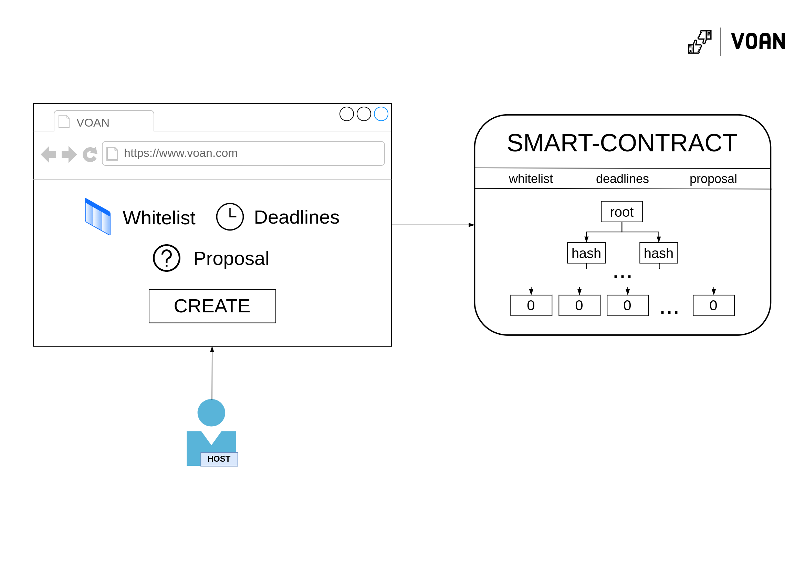
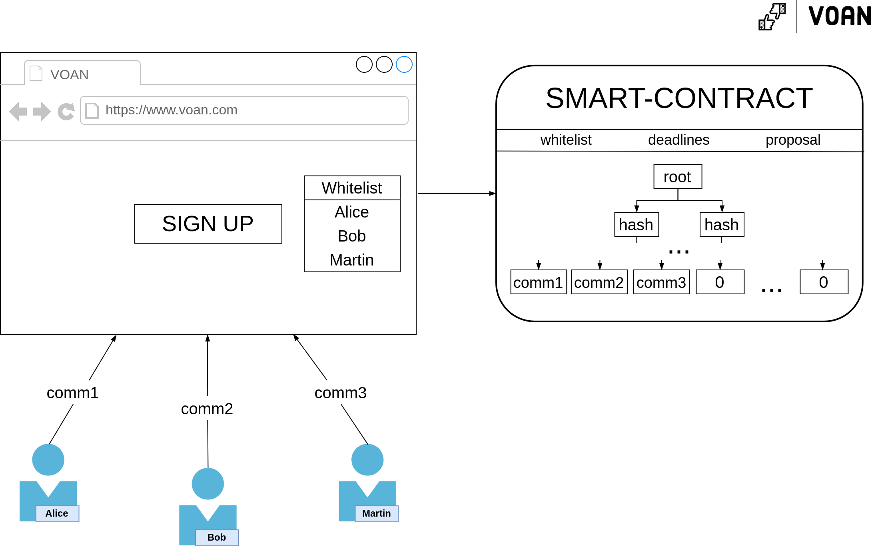
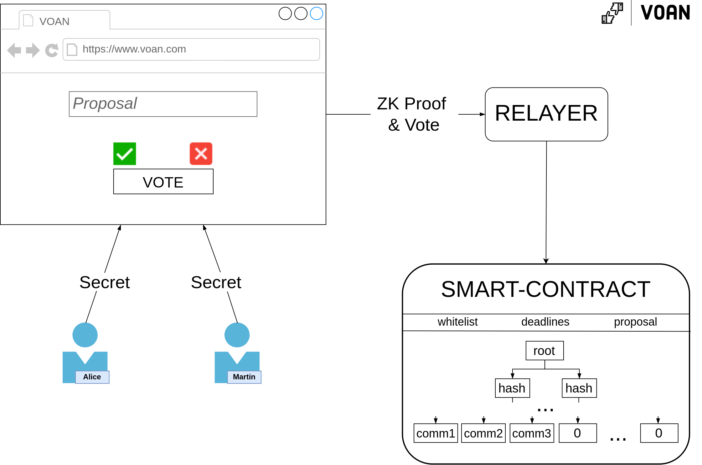

<h1 align="center">VOAN</h1>

    

<h4 align="center">ANonymous VOtings platform on NEAR Protocol</h4>

___

<h2 align="center">Motivation</h2>

One of the key requirements for voting is **privacy**. There is no *privacy-by-default* on the NEAR Protocol. The main motivation for VoAn comes from the experience of participating in DAOs: you cannot vote against the proposal, because you may offend someone. Anonymity would be a great option.

<i>Privacy is normal!</i>

---

<h2 align="center">How it works</h2>

### Abstract
As everything on the blockchains is visible to others (f.e. you cannot send tokens to your friends privately) it is impossible to build privacy preserving apps on modern blockchains (NEAR Protocol, Ethereum) without the help of other primitives. The main component which enables us to build such apps is *zk-cryptography*: at its core, it allows us to prove that we know some information, without revealing that information. For example: for some publicly-known number \\(c\\), I can prove that I know factors \\(a\\) and \\(b\\) (without revealing them), such that \\(a * b = c\\). This notion can be taken further to essentially prove that a party belong to a certain set without revealing which party they are (this is what is known as a proof of set membership). Zero knowledge group membership is actually the key mechanism behind anonymous voting. Let's divide the process into several stages:

1. Voting creation/initialization
2. Voting itself

In the first step, the host of a voting sets the rules for the vote: which proposal, deadlines, jury list/whitelist, etc. The main thing here is the whitelist. This whitelist contains the public keys of participants authorized to take part in the vote. 

In the second step, participants can vote. They do so by proving their knowledge of a private key that matches their public key and that this exact public key is in the whitelist. 
By that, participants don't reveal themselves directly but are still able to prove that they have the right to vote (if a person was not on the whitelist, he would not be able to create such evidence).

There are few problems with this naive scheme, some of which you might have noticed yourself:

1. Participants can vote more than once
2. Participants will reveal themselves if they call the transaction from their publicly known address/account

Let's discuss the second problem first. As already mentioned, due to the transparency of the blockchain, if a participant calls a vote-transaction from his address, he will reveal his identity. One of the solutions can come to mind is to create a new account and vote from it. But in blockchains, you have to pay a GAS fee for execute contract calls. So, you would need to top up the balance of a new account, but if you do so, it will be easy to establish a connection between a publicly known account and this new one. Seems impossible now ... But, actually we can delegate the transaction call to a separate person - *relayer*, who will pay for our transaction. By doing so, we don't even need to interact with the blockchain (the relayer will do it for us). There are few problems with that too, but they are solvable:

* Relayer can frontrun (change our vote value) - this can be solved if the proof depends on the vote value (so if he changes it, the proof will become invalid and be rejected by the smart contract)
* Relayer can censor votes - this can be solved if there are many relayers
* Relayer need money/other motivation to work - this can be solved with an incentive mechanism or if host pays fees to relayers

Before we move to the first problem (double voting), it's important to say that the use of real blockchain accounts (namely, the creation of proofs of ownership of a private key) is not a ZK-Friendly operation (you as a client will create such a proof for a very long time), that's why we need to think about other ways to do it ... one solution is by adding an additional stage - **registration**. Here we will randomly generate a secret number and send the *commitment* (hash of the secret number) to the smart-contract such that the *commitment* will mimic the role of the public key; and of course - we can make proving the knowledge of the preimage of the hash-function ZK-Friendly.

Now, let's discuss how to solve the first problem ... the solution is really simple: at the registration stage, instead of generating one number (\\(secret\\)), you can generate another one (let's call it \\(nullifier)\\) ​​and \\(commitment = Hash(secret, nullifier)\\). Then, at the voting stage, when we make a ZK proof, we will reveal the \\(nullifier\\). This way we never reveal the secrets to generate a full proof, but since each proof we produce will be using the same nullifier, if the smart contract keeps track of used nullifiers, we won't be able to vote twice.

**So, let's go over the whole process again**:

**Voting creation/initialization**:

    

    <i>Voting creation scheme</i>

Done by host as described earlier.

**Registration**:

    

    <i>Registration scheme</i>

Users from the whitelist can sign up for voting by submitting a commitment = \\(Hash(secret, nullifier)\\).

**Voting**:

    

    <i>Voting scheme</i>

Participants choose a vote option (yes or no) 
and vote through the relayer, by creating a ZK proof *locally* (by using their secret) that they are one of the registered members and then sending the proof him.

### Tech stack
Programming languages: 
* Rust - [Smart-contract](./contract/), [tests](./tests/)
* Circom - [zkSNARK circuits](./circuits/)
* NodeJS - [Relayer](./relayer/)
* JS | React | SnarkJS - [WebUI](./web-ui/) + ZK proofs generation

Primitives:
* Groth16 proving scheme - used for zkp-side (arkworks-rs/groth16 + electron-labs/verifier & SnarkJS + Circom)
* [Merkle Tree](./contract/src/merkle_tree.rs) + [MiMCSponge](https://github.com/tzilkha/mimc-sponge-rs) (fully implemented by our team)
