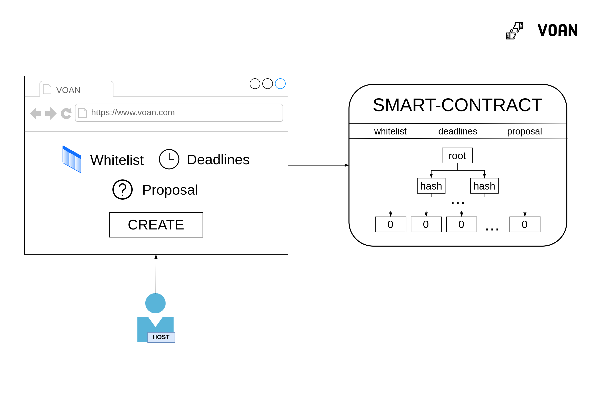
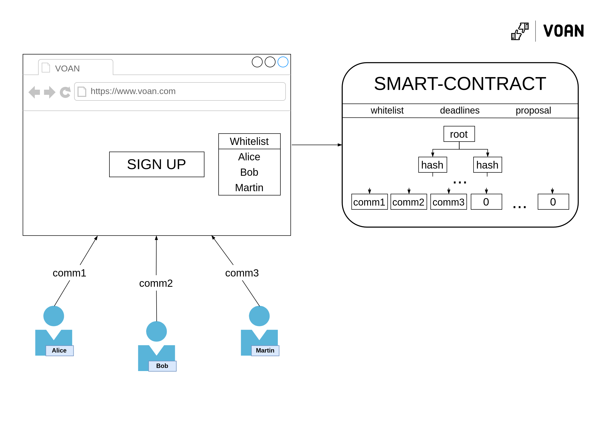
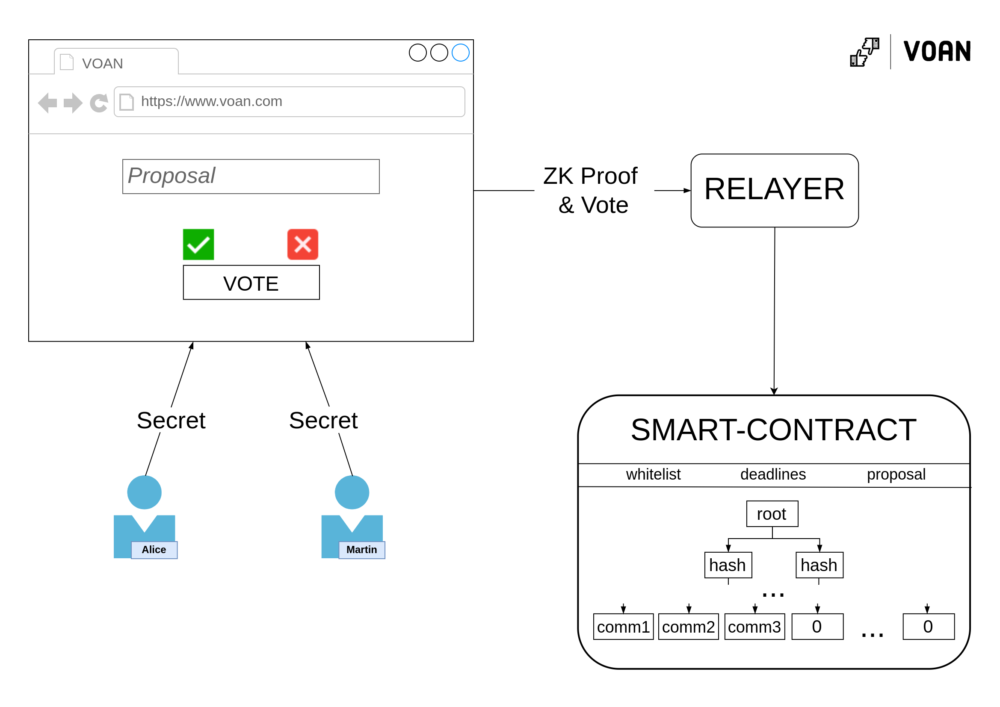

# How it works

## Abstract
As everything on blockchains is visible to others (f.e. you cannot send tokens to your friends privately) it is impossible to build apps with privacy on modern blockchains (NEAR Protocol, Ethereum) without the help of other primitives. The thing that helps us to build such apps is *zk-cryptography*: it allows us to prove that we know some information, without revealing this information, for example: for some publicly-known number \\(c\\), I can prove that I know factors \\(a\\) and \\(b\\) (without revealing them), such that \\(a * b = c\\). Thus, we can prove that we belong to a certain set without revealing who we are (that is also called proof of set membership) ... and that actually the key mechanism of voting. Let's divide the vote into several stages:

1. Voting creation/initialization
2. Voting itself

In the first step, host of a voting sets the rules: proposal, deadlines, jury list/whitelist, etc. The main thing here is the whitelist. This whitelist contains public keys of participants of a voting. 

In the second step participants can vote, and they can do that by proving the knowledge of a private key that matches their public key and that this exact public key is in the whitelist. 
By that participant didn't reveal himself and really was able to prove that he has the right to vote (if a person were not on the whitelist, he would not be able to create such evidence).

There are few problems here and some you might noticed yourself:

1. Participant can vote more than once
2. Participant will reveal himself if he calls the transaction from his publicly known address/account

Let's discuss second problem first. As already said, if a participant calls vote-transaction from his address, he reveals himself. One of the solutions that can come to mind to create new account and vote from it. But in blockchains you have to pay a GAS fee. So, you need to top up the balance of a new account, but if you do that it will be easy to establish a connection between a publicly known account and a new one. Seems impossible now ... But, actually we can delegate the transaction call to a separate person - *relayer*, so he'll pay for our transaction and we don't even need blockchain interaction (relayer will do it for us). There are few problems with that too, but they are solvable:

* Relayer can frontrun (change our vote value) - this can be solved if the proof depends on the vote value (so if he changes it, the proof'll be invalid)
* Relayer can censor votes - this can be solved if there are many relayers
* Relayer need money/other motivation to work - this can be solved with tokenomics or if host pays for that

Before we move to the first problem (vote more than once) it's important to say that the use of real blockchain accounts (namely, the creation of proofs of ownership of a private key) is not ZK-Friendly operation (you as a client will create such a proof for a very long time), that's why we need to think about other way to do that ... and we can do that by adding additional stage - **registration**. Here we'll randomly generate secret number and send the *commitment* (hash of secret number) to the smart-contract, so the *commitment* will mimic the public key; and of course - we can make proving the knowledge of the preimage of the hash-function ZK-Friendly.

Now, let's discuss how to solve the first problem ... the solution is really simple: at the registration stage, instead of generating one number (\\(secret\\)), you can generate another one (let's call it \\(nullifier)\\) ​​and \\(commitment = Hash(secret, nullifier)\\). Then, at the voting stage, when we make a ZK proof, we will reveal the \\(nullifier\\). This way we won't declassify ourselves, but we won't be able to vote twice with the same nullifier either.

### Voting creation/initialization

    

    <i>Voting creation scheme</i>

Done by host as described earlier.

### Registration

    

    <i>Registration scheme</i>

People from whitelist can sign up for voting by submitting a commitment = \\(Hash(secret, nullifier)\\).

### Voting

    

    <i>Voting scheme</i>

Participants choose a vote option (yes or no) 
and vote through the relayer, by creating a ZK proof (by passing their secret) that they are one of the registered members and sending it to him.

## Tech stack
Programming languages: 
* Rust - [Smart-contract](./contract/), [tests](./tests/)
* Circom - [zkSNARK circuits](./circuits/)
* NodeJS - [Relayer](./relayer/)
* JS | React | SnarkJS - [WebUI](./web-ui/) + ZK proofs generation

Primitives:
* Groth16 proving scheme - used for a zkp-side (arkworks-rs/groth16 + electron-labs/verifier & SnarkJS + Circom)
* [Merkle Tree](./contract/src/merkle_tree.rs) + [MiMCSponge](https://github.com/tzilkha/mimc-sponge-rs) (fully implemented by our team)